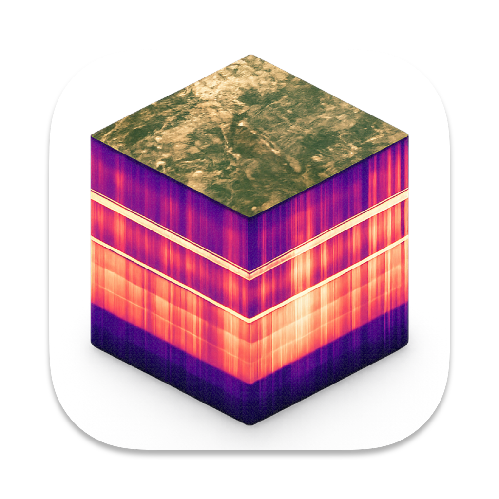
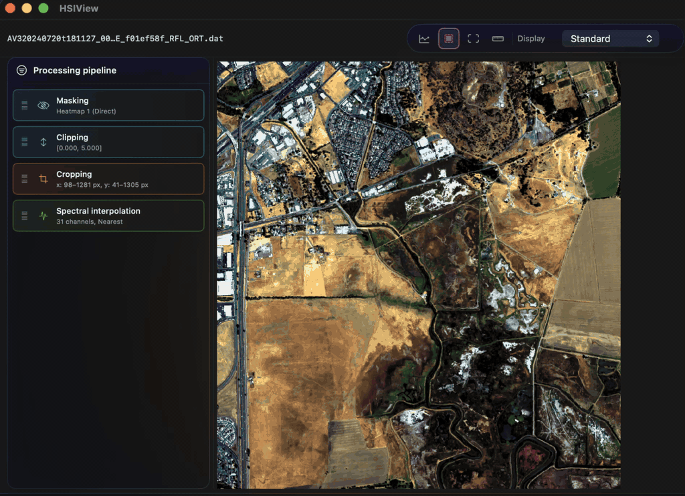
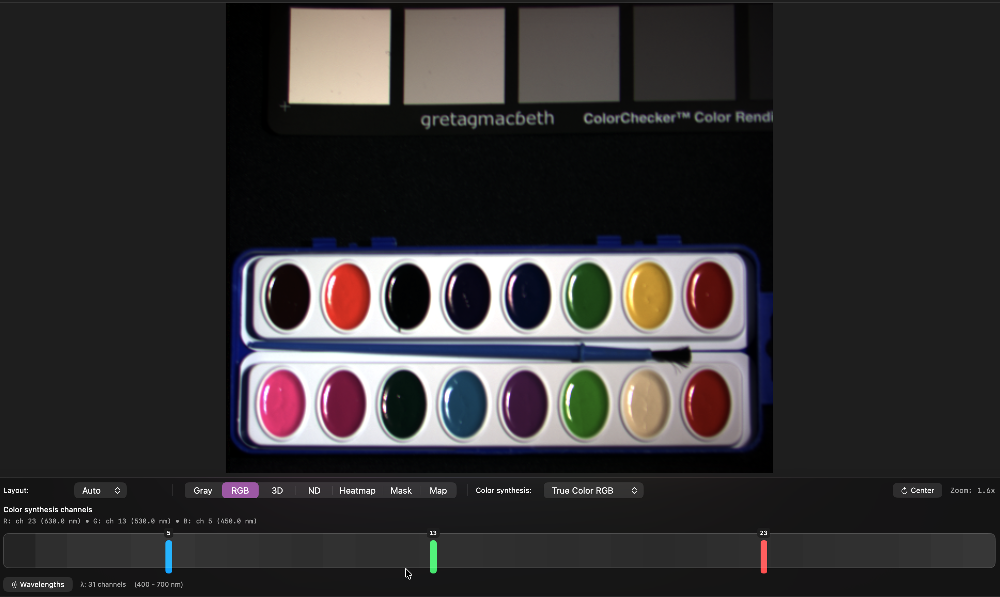
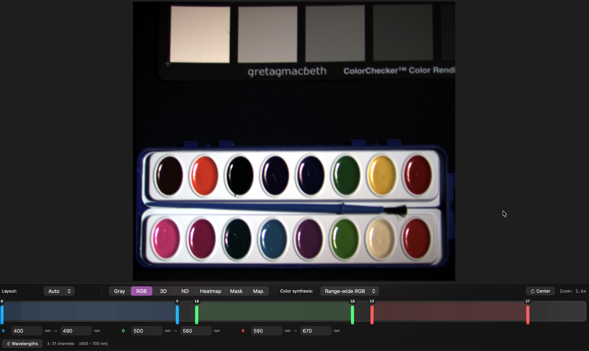
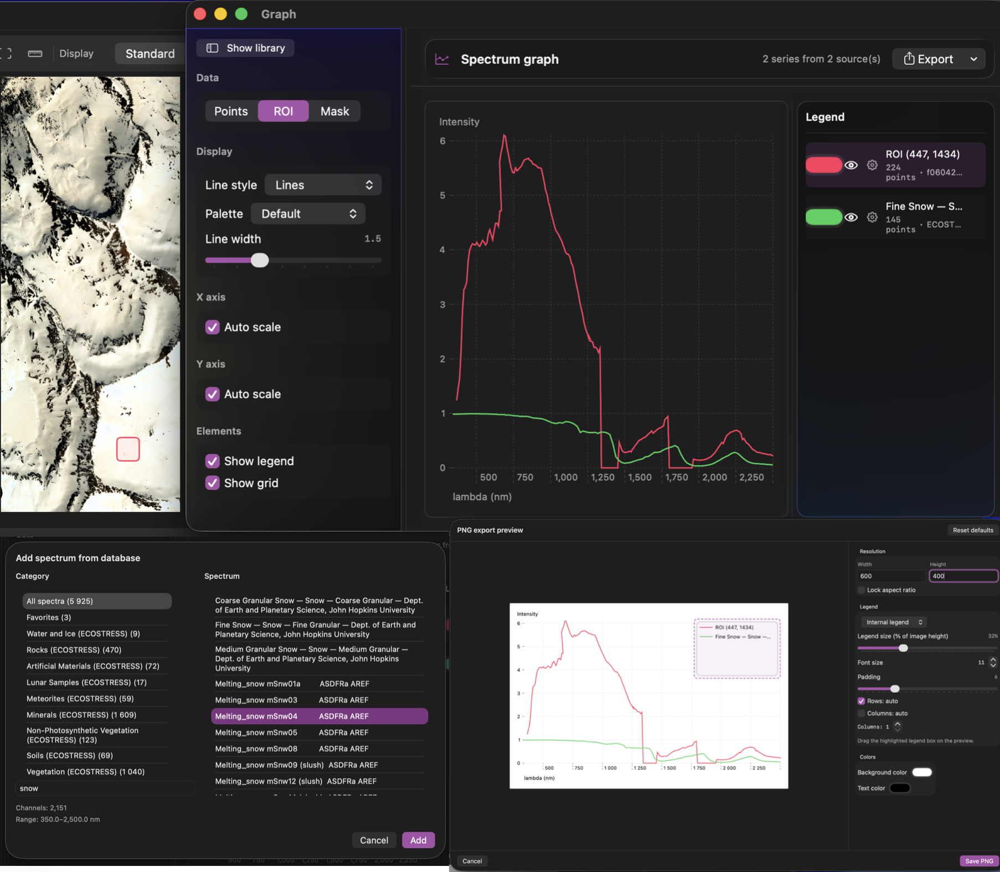

  
  <h1>HSIView</h1>
  
Native macOS app for hyperspectral imaging workflows

---

## What is HSIView

HSIView is a native macOS desktop application for hyperspectral imaging workflows: it lets users open, visualize, analyze, process, and export hyperspectral images in common formats. It is for hyperspectral imaging practitioners who need practical day-to-day data work in one tool, such as remote sensing specialists, research engineers, data analysts, and applied scientists working with spectral data.

It started as a lightweight app for fast hyperspectral file preview. Over time, it evolved as more and more tasks that were previously handled with Python scripts were brought directly into the product. This led to its core philosophy: *any routine hyperspectral task should be possible inside one application*. Today, HSIView is built to reduce code-heavy workflows and let users process, analyze, and export hyperspectral data with minimal scripting.

## Installation from GitHub

1. Open the project repository on GitHub.
2. Go to the **Releases** section.
3. Select the latest stable release.
4. Download the attached archive.
5. Unzip the archive.
6. Drag `HSIView.app` to the **Applications** folder.
7. Launch the app.

If macOS blocks the first launch, right-click **HSIView.app** and choose **Open**, then confirm.
You can also allow it in **System Settings → Privacy & Security**.

## What can you do?

### Open HSI with common extensions

You can open HSI files directly from **Finder**, which makes everyday work much faster. Supported formats include: `npy`, `mat`, `tiff`, `dat`/`img`/`bsq`/`bil`/`raw` + `hdr`, `hsiv`.

### Process HSI data with a reproducible pipeline

HSIView includes a built-in processing pipeline so you can apply preprocessing and transformation steps directly in the app. Operations are configured in the UI and applied in sequence to the current cube, which makes processing transparent and repeatable across multiple files.

Processing operations include:

- radiometric calibration
- atmospheric correction
- normalization operations
- data type conversion
- masking data
- clipping values
- transformations (rotation, resize, crop, transpose)
- channel trimming
- spectral interpolation
- PCA
- per-channel homography

You can tune the parameters and reuse the same logic for other datasets in your library.

HSIView also supports **custom Python-based operations**: you can define your own processing function and run it as part of the pipeline (with a Python 3 interpreter).

### Visualize data with color modes

HSIView provides two complementary color synthesis modes for HSI:

1. **Discrete RGB synthesis (band-based):** assign specific spectral bands to the R, G, and B channels.

2. **Range-wide RGB (interval-based):** define wavelength ranges for each channel instead of single bands.

### Work with spectra

HSIView provides a full in-app workflow for spectral analysis. You can extract spectra from:

- a single pixel
- ROI regions
- mask layers

All extracted spectra are managed in the **Graph Window**, where you can compare multiple curves from the current HSI and from saved library entries.

For sharing and reporting, spectra can be exported as `JSON` or `PNG`.

HSIView also includes a built-in spectral reference library and supports saving your own spectra as favorites, so you can quickly reuse reference signatures across sessions and datasets.
